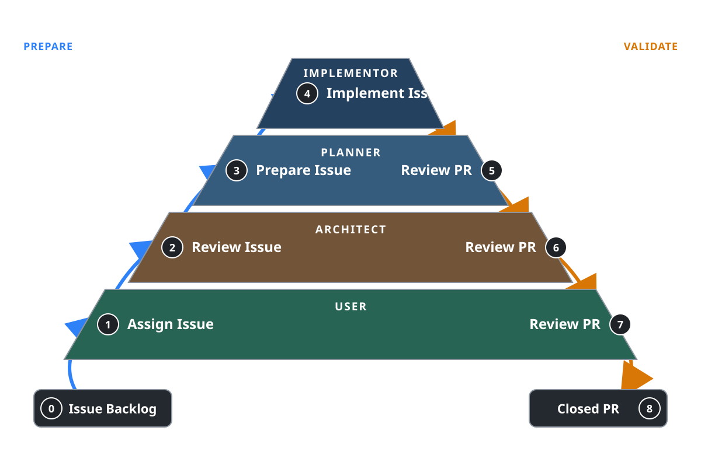

# GitHub Actions-hosted AI Software Factory

You open one GitHub issue and the factory carries it to a merged pull request or
an explicit abandonment, without anybody having to remember where it got to. One
GitHub Project item shows who owns the work now; the retained XMD run proves how
the item reached that owner. Every stage the item passed through, every revision
that was reviewed, and every effect that reached GitHub are in one durable
journal addressed by the issue itself.

The factory has no independent controller. A durable XMD workflow run is the
whole procedure. GitHub Actions supplies an ephemeral trusted runner; a
Cloudflare Durable Object supplies the run's durable state; a dedicated GitHub
App supplies authenticated ingress and the credential every GitHub effect is
performed with. The XMD workflow invokes roles, validates their structured
outcomes, records handoffs, performs authorized GitHub and Workspace effects,
updates the Project status, and journals those effects.

Three planes are separate throughout, and keeping them separate is what the rest
of this specification spends its length on:

- the **executor plane**, one authenticated WebSocket connection that advances
  the run;
- the **delivery plane**, authenticated transactions that retain an intake, an
  answer or a decision without executing anything; and
- the **inspection plane**, read-only reads that can never become transition
  authority.

## 1. One issue, one durable run

One issue corresponds to one durable XMD factory run. The run may produce and
review many implementation revisions before it closes; a new implementation
commit never creates a new factory run.

### 1.1 The run ID is derived from the issue

Admission rereads the GitHub issue from the API before it derives anything. The
**factory run ID** is then the lowercase unpadded RFC 4648 Base32 encoding of
the full SHA-256 digest of these UTF-8 bytes, concatenated in this order:

```text
"github-issue-v1" || 0x00 || canonical GitHub authority || 0x00 || issue node ID
```

The digest is all 32 bytes, so the run ID is 52 Base32 characters with no
padding and no separators. It is a public run ID in the sense §9 of the workflow
specification already defines: non-empty, containing no NUL, opaque to
everything but equality and lifecycle addressing.

The **canonical GitHub authority** is the lowercase DNS hostname of the GitHub
deployment, plus `:` and the port when the port is not the scheme's default. It
carries no scheme, path, query, fragment, user information or trailing
separator, so one deployment has exactly one spelling. The **issue node ID** is
the exact string GitHub's GraphQL API returns for that issue, compared byte for
byte with no case folding and no Unicode normalization: it is an opaque provider
identity, and normalizing it would be inventing a second one.

Nothing mutable participates. Repository names, issue numbers, Project, Project
item and status identities, comments, branch names, implementation revisions,
the workflow definition SHA, webhook delivery IDs and actor identities all
change while the run stays the run it was, so none of them is an input to the
derivation.

Two consequences follow directly. Duplicate admission for the same authenticated
subject derives the same run ID and therefore routes to the same run rather than
creating a second one — the compatible-reuse rule of the workflow contract does
the rest. And a reread that returns a different retained provider identity for
the same subject, including an issue transfer that changes the node ID, is
unsupported drift: the host refuses it, names it as drift, and creates no second
run. Silently starting another run would leave two frontiers claiming one piece
of work.

### 1.2 Two SHA identities, and neither is the run

Two SHA identities remain separate throughout the run, and neither is the run
ID:

- The **workflow definition SHA** is the immutable Git commit in the XMD
  workflow definition. It fixes the procedure and its component bundle for the
  lifetime of the run. A different definition is not a revision of the same run;
  it requires a new run or an eligible history fork under the workflow lifecycle
  contract.
- The **implementation revision** is the evolving pair `{ headSha, baseSha }`.
  `headSha` is the exact commit at the draft pull request's head, and `baseSha`
  is the exact target-branch commit against which that head is evaluated.

The definition SHA authorizes which procedure executes. The implementation
revision identifies what the procedure is currently producing or reviewing.
Neither substitutes for the other, and neither a Project field nor a comment may
rewrite either identity.

## 2. Lifecycle and validation frontier



The Project status has these values:

| Stage | Status | Owner | Question answered |
| ---: | --- | --- | --- |
| 0 | Backlog | User | Is this item admitted to the factory? |
| 1 | User | User | What product outcome and acceptance boundary are intended? |
| 2 | Architect | Architect | Is the structural contract ready? |
| 3 | Planner | Planner | Is there an implementation-ready plan and evidence matrix? |
| 4 | Implementor | Implementor | Does an implementation revision satisfy the accepted plan? |
| 5 | Planner Review | Planner | Does this exact revision satisfy the frozen acceptance criteria? |
| 6 | Architect Review | Architect | Does this exact revision satisfy the frozen structural checklist? |
| 7 | User Review | User | Is this exact validated result accepted? |
| 8 | Closed | None | Was the item merged or abandoned? |

Those nine strings are the exact status vocabulary. The diagram above shows the
same eight stages as two ownership bands: the left side progressively removes
uncertainty — product intent, structural contract, implementation plan, then
code — and the right side validates the result — implementation evidence,
structural correctness, user acceptance, then completion.

Moving an authorized Backlog item to User admits it and starts its factory run.
Once admitted, an ordinary successful outcome advances exactly one stage:

```text
1 -> 2 -> 3 -> 4 -> 5 -> 6 -> 7 -> 8
```

No role may pass an item over an intermediate role. The XMD workflow rejects an
outcome that attempts to advance by more than one stage. It commits the current
stage's handoff before invoking the next role, so the next role receives the
accepted chain rather than an uncommitted result.

The **validation frontier** is the latest active chain of accepted handoffs.
Every stage receives that chain and adds one decision. Invalidated conclusions
remain historical records, but they are outside the active frontier and cannot
authorize later progress.

### 2.1 Same-stage iteration

Self-correction is iteration, not progress:

- An Architect amending the structural contract remains at Stage 2 until the
  amended contract passes readiness.
- A Planner amending the issue or plan remains at Stage 3 until the latest plan
  passes.
- An Implementor producing, synchronizing, or correcting an implementation
  remains at Stage 4 until the latest implementation revision passes.
- A reviewer replacing a malformed or incomplete verdict remains at that review
  stage until a valid verdict identifies the exact revision reviewed.

The role's latest accepted same-stage output supersedes its earlier output at
the active frontier without erasing history. The superseded output stays in the
journal and stays readable; what it loses is the authority to carry the item
forward.

### 2.2 Backward invalidation

A backward transition jumps to the earliest contract the new information
invalidates. Forward progress then traverses every later stage again:

| Returned to | Still valid | Must run again |
| --- | --- | --- |
| User (1) | Nothing downstream | 2-7 |
| Architect (2) | Product decision | 2-7 |
| Planner (3) | Product decision and architecture | 3-7 |
| Implementor (4) | Product decision, architecture, and plan | 4-7 |
| Planner Review (5) | The implementation revision | 5-7 |
| Architect Review (6) | The Planner verdict for that revision | 6-7 |

The workflow validates a backward outcome against this frontier. The role
supplies the reason and earliest invalidated stage; the XMD procedure decides
which accepted downstream handoffs become inactive and records that decision. A
Project edit alone never proves invalidation or approval.

### 2.3 Revision invalidation

Every Stage 5, Stage 6, and Stage 7 conclusion identifies the exact
`{ headSha, baseSha }` it evaluated.

- Any merge, manual edit, conflict resolution, or other change to `headSha`
  remains at or returns to Stage 4 and invalidates Stages 5-7.
- Movement of `baseSha` without a head change invalidates the review context at
  Stage 5. The item repeats Stages 5-7 against the new pair when no
  synchronization or implementation correction is required.
- When base movement requires synchronization, conflict resolution, or an
  implementation change, the item returns to Stage 4 and repeats Stages 4-7.
- An invalidated Planner verdict returns to Stage 5. An invalidated Architect
  verdict returns to Stage 6.

Stage 6 accepts a Planner verdict only when that verdict names the same
implementation revision. Stage 7 accepts the review chain only when both review
verdicts name the current revision. A later SHA never inherits a verdict for an
earlier pair.

Only an accepted Stage 6 verdict for the current revision is **ready
authority**: it is what authorizes XMD to take the pull request out of draft and
move the item to Stage 7. Ready state observed on GitHub without that accepted
verdict is drift to reconcile, never a substitute for it.

The workflow definition SHA does not participate in this invalidation table.
Definition incompatibility is a workflow lifecycle refusal, not an
implementation correction.

### 2.4 Terminal kinds

Stage 7 -> 8 is the adjacent terminal transition, and it has exactly two kinds.
A **merged** terminal records that the reviewed revision reached the target
branch. An **abandoned** terminal records that an authorized human ended the run
without publishing it. Both are described in §10, which owns their effect
ordering; what matters here is that they are the only two ways an admitted run
becomes terminal, and that each names the exact reviewed revision it settled on.

## 3. Deployment topology

Three hosts carry one run, and each owns something the others cannot reach.

```text
GitHub App (ingress, credentials)
        │ webhook / form / repository_dispatch
        ▼
Cloudflare Durable Object ── SQLite ── WorkflowRun, Workspace roots, journal
        ▲
        │ authenticated WebSocket (executor acquisition)
        ▼
GitHub Actions ephemeral runner ── native Git, evidence processes, Agent clients
```

**One SQLite-backed Cloudflare Durable Object, selected from the run ID, owns
the run.** It holds the WorkflowRun record and its filtered journal, the
immutable Workspace roots and their content-addressed bytes, the Agent-session
mappings and checkpoints, pending answers and Stage 7 decisions, the retained
intake records, and executor ownership. There is one durable owner per run,
selected arithmetically from the run ID exactly as local discovery is, so no
second registry can disagree with it.

**Exported `.xmd` artifacts are immutable evidence only.** They are never live
state, discovery, continuation, answer delivery, or lock authority, and no
Actions artifact is any of those either. An artifact says what a run had
committed at one frontier; it does not say what a run may do next.

**One authenticated Durable Object WebSocket connection owns the executor
acquisition.** The acquisition is the connection's lifetime and nothing else. It
has no duration, expiry, renewal, heartbeat, PID, liveness poll or application
lease, exactly as the local executor lock has none. Closing the WebSocket
invalidates the acquisition and releases executor ownership; it does not roll
back state that already committed. A second healthy executor follows the active
one or is refused, and cannot advance the run either way.

**The ephemeral Actions runner executes what cannot run inside a Durable
Object.** Native Git, plan evidence processes and Agent clients run there,
against bounded materialized state, and only there. The runner materializes one
selected retained Workspace root, submits content-addressed changes, and the
Durable Object validates the acquisition, the expected root and the content
before it atomically publishes the new root together with the filtered journal
result. A runner crash therefore exposes only a prior or a new complete
transaction; a later connection performs stale recovery and resumes from the
exact committed WorkflowRun and Workspace frontier.

**The Cloudflare runtime-named host owns persistence and admission.** Durable
transactions, intake, the authorization gates, token minting and executor
admission are its. Shared production modules stay provider-neutral: they do not
detect Cloudflare, Deno, GitHub Actions or any other runtime, and they reach
every host-specific behavior through the contextual APIs that already exist.

**A completed replay attaches nothing.** It contacts no remote storage session
and attaches no Workspace, Agent, process, Git, GitHub, Project or credential
provider. That is the property §10's terminal ordering exists to preserve.

## 4. Durable procedure and GitHub projection

The XMD workflow is the only procedure that may change the factory stage. On a
start or resume the executor:

1. acquires the run's executor connection;
2. restores the retained workflow definition, Workspace, handoff chain, and
   incomplete effects;
3. observes the issue, draft pull request, Project item, and exact Git revision
   identities required by the current stage;
4. reconciles interrupted GitHub effects under their retained identities;
5. consumes any retained answer or Stage 7 decision inside the run's
   transaction, appending its accepted durable event exactly once;
6. renders the active handoff chain and authorized observations to the current
   role;
7. validates the role's structured outcome against the current stage, artifact
   identities, and implementation revision;
8. records a same-stage iteration or invalidates the frontier, or performs the
   immediately adjacent successful transition;
9. performs the authorized issue, pull-request, Git, and Project effects; and
10. journals the accepted decision and every effect before yielding the next
    durable boundary.

Every step above is executor-owned. Start and resume, stale-execution recovery,
document execution, Workspace mutation, Agent attachment, native Git and
evidence execution, lifecycle transition, accepted-outcome publication and
terminal settlement each validate the exact live acquisition and the expected
Workspace root inside every mutation transaction. An acquisition that is closed,
foreign or stale reaches no mutation.

Two kinds of operation are deliberately outside that list.

**Delivery is not execution.** Authenticated webhook and form intake, typed
answer delivery, and Stage 7 decision delivery are delivery-plane transactions.
Each takes no executor acquisition, starts no execution, attaches no Workspace,
Agent or process provider, appends no lifecycle outcome and changes no run
status. Each validates its exact delivery identity and its exact pending
suspension or decision subject, and retains only the typed bounded value that
subject describes. This is the answer-delivery contract the workflow
specification already states, applied unchanged to a remote host and extended to
Stage 7 decisions.

**Inspection is not authority.** Status and history reads are read-only, take no
executor acquisition, and cannot become transition authority. They observe the
same immutable snapshot surface local inspection observes.

A later executor is what turns a retained answer or decision into progress. It
consumes the retained value inside the run's own transaction, appends the
accepted durable event or outcome once, and only then may authored XMD choose
the next transition. Delivery stores; execution decides.

GitHub Actions supplies the trusted executable, the definition reference, the
run identity, and credentials or provider configuration within a fixed ceiling.
Its YAML does not parse role conclusions, choose stages, construct handoffs,
change draft state, merge, comment, or update the Project independently of the
XMD workflow. Actions concurrency may reduce duplicate invocations, but it is
not the executor acquisition and cannot authorize a transition.

The XMD journal is lifecycle authority. The Project status is a human-facing
projection of the journaled current stage, and issue and pull-request comments
are human-readable transition records. A Project status, comment or pull-request
state ahead of the journal is drift to reconcile, never proof that a skipped
role passed.

GitHub offers no transaction spanning a comment, draft state, Project status,
branch update, or merge and the retained XMD store, and none is claimed across
Durable Object state, native Git and processes, GitHub and Project V2. Each
GitHub mutation is therefore one durable external effect with a stable
engine-derived identity and an effect-specific natural key: it observes before
it mutates, adopts only a compatible completion, performs once from proven
absence or an exact compatible pre-state, and refuses conflict, permanent
ambiguity, incomplete observation and temporary unavailability. Cancellation
tears the provider call down and publishes no invented completion; an
interrupted remote completion is reobserved and adopted only when it matches the
retained intent; a completed replay contacts no provider at all.

The natural keys are exact. A comment uses its subject plus the engine-derived
effect identity, so the body and title are presentation rather than identity. A
Project status uses the exact Project item plus field. Ready, close and the
merged observation use their exact issue or pull-request subject. Target
publication uses the retained repository plus the configured remote and target
ref. Accepted outcomes are
retained before their projections are attempted, and reconciliation completes
each intended projection.

## 5. Authenticated ingress

A dedicated GitHub App is the factory's only ingress. It receives Project and
admission webhooks and authenticated human form submissions, and it is the
principal every GitHub effect is performed as.

### 5.1 Order of operations

An intake is admitted in this order, and no step may be reordered:

1. **Verify before parsing.** The webhook signature is verified against the
   App's webhook secret before the payload is parsed as anything but bytes.
2. **Reread from the API.** The complete GitHub objects — issue, repository,
   Project, Project item, status field — are reread through the API. The
   payload's copy of them is a notification, not a source of truth.
3. **Authenticate the installation and the actor.** The installation is resolved
   for the exact repository, and the human actor is resolved as an identity
   rather than a display name.
4. **Retain one bounded intake.** The intake is keyed by the GitHub delivery
   identity for a webhook, or the submission identity for a form, and retains
   only bounded typed fields.

Admission requires a configured organization-owned Project V2 and the exact
repository, Project, Project item, status field and allowed option IDs. A
missing page of results, an unavailable field, an ambiguous object and a partial
permission read are all **unavailable** — they are neither absence nor
authorization. Treating an unreadable Project as an empty one is how an
unauthorized item would be admitted.

**A configured table maps status options to stages, in both directions.** It is a total bijection between the nine `FactoryStage` values of §11.2 and nine exact Project V2 status option IDs: one option ID for every stage `0` through `8`, and every configured option ID appearing exactly once. It is host configuration and part of the admission and projection ceiling — never an authored prop, and never something a provider payload can supply.

The table is validated before it is used. Startup and admission refuse — before an intake is retained, a token is minted, a run is started, or anything is projected — when the table is missing, partial, holds a duplicate, names an option the Project does not currently offer, names an option belonging to another field or another Project, or names an option whose display name reread from GitHub is not the settled §2 status string for its stage.

Admission maps the completely reread option ID to a stage through that table, and projection maps a retained stage back to its option ID through the inverse. Neither direction parses a display string: the strings are what a person reads, the option IDs are what the factory compares, and a status renamed on the board is a configuration refusal rather than a silent remapping.

Only the configured `Backlog`-to-`User` movement admits a new item. A Project edit at any other point is projection drift or an authenticated intake to reconcile, and is never a role verdict.

A duplicate delivery of the same identity finds the retained intake and changes
nothing. That is the same compatible-reuse rule run identity uses, applied to
intake.

### 5.2 Waking Actions carries no decision

`repository_dispatch` carries only the retained intake identity. The receiving
Actions workflow may be woken by it, but the payload never carries or derives a
stage, a role outcome, answer text, a decision, a transition, a credential, or a
mutable factory definition. Everything the run needs it reads from the Durable
Object after it has authenticated.

### 5.3 The runner authenticates with OIDC

The Actions job authenticates to the provider through GitHub OIDC. Before it
admits a session, the provider validates the issuer, the configured audience,
the repository ID, the repository-owner ID, the event name, the workflow ref and
SHA, and the configured immutable workflow identity. Repository *names* are
mutable and are not what is checked; IDs are.

### 5.4 Human answers and decisions

Human answers and Stage 7 decisions arrive through a GitHub-App-authenticated
web form bound to the exact retained suspension or decision subject. The form
submission is a delivery-plane transaction under §4.

**Comment text is never authority.** A comment never answers a question, merges,
authorizes a change, abandons a run or resumes execution. Comments are
transition records a person reads.

A human may authorize admission, an answer, a Stage 7 change, a merge or an
abandonment only while holding Project write and repository write-or-higher
access, checked at the moment of the submission. The short-lived App
installation token performs the GitHub effects that follow; the journal retains
the human actor separately from the token that acted, so the record says who
decided as well as what was done.

## 6. Principal, permissions and host ceilings

The GitHub App has exactly these repository permissions — Metadata read,
Contents write, Issues write, Pull requests write, Checks read, Commit statuses
read — and organization Projects write. It has no Administration, Actions write,
Workflows write, Secrets, Environments, Deployments or Members permission, and
no force-push authority anywhere.

The App installation is limited to configured repositories. The host narrows
further, per operation, to the exact repository, implementation branch, target
branch, organization Project, status field, option IDs, issue or pull-request
subject, reviewed revision, parent pair, and non-force operation. A ceiling the
installation grants is not a ceiling the host uses.

Three more ceilings are host configuration on the same terms, none of them an authored prop: the stage-to-option bijection of §5.1; the merge authority `Git.Merge` validates its authored parents against, which supplies the current implementation head and observed target base for a synchronization and the reviewed `{ headSha, baseSha }` the Stage 7 decision authorized for a publication; and the bounded retry — count, total duration and backoff — the merged observation of §10.4 runs under. `Evidence.Run`'s executable, environment, working-root, per-command duration, whole-run duration, output and process-tree ceilings are the same kind of configuration, stated in [Workflow workspaces](./workflow-workspace-spec.md) §10.5.

Mutation of `.github/workflows/**` is refused, even though Contents write could
otherwise reach it. A factory that can rewrite the workflow that runs it is a
factory that can rewrite its own authorization.

GitHub App private keys, webhook secrets, OIDC verification configuration,
issued installation tokens, provider endpoints, raw payloads, cursors and host
paths are provider secrets and closure state. None of them enters props, context
composition data, durable requests or results, comments, output or diagnostics.

The configured target ruleset admits only this factory's dedicated App for the
target-branch update of §10, and host validation independently enforces the
target and the reviewed parent pair. Neither substitutes for the other: the
ruleset says who may write, the host says what may be written.

## 7. Issue and draft pull-request boundary

The issue owns product intent, architecture, planning, and the transition into
implementation.

- Stage 1-3 iterations and accepted handoffs are full issue comments.
- The accepted Stage 3 -> 4 handoff on the issue names the plan and evidence
  matrix the Implementor receives.
- The issue remains the source of those upstream contracts after a draft pull
  request exists.

Stage 4 creates or updates a draft pull request before its first handoff to
Planner Review. The Stage 4 -> 5 handoff identifies the draft pull request and
its exact `{ headSha, baseSha }`. The draft pull request then owns
implementation iterations and Stage 5-7 review handoffs.

When invalidation crosses from the pull request to Stages 1-3, the XMD workflow
writes the full handoff on the issue and a short linking record on the pull
request. When the accepted issue chain crosses back into Stage 4, the draft pull
request links the accepted issue handoff before implementation continues.

The pull request remains draft throughout Stage 4 corrections and Stage 5
review. It also remains draft while Stage 6 requests a backward correction. Only
the ready authority of §2.3 takes it out of draft. If interruption separates
those GitHub effects, the run remains at its last journaled frontier and resume
reconciles both.

Closing the Project item never erases the issue, pull request, handoff history
or XMD journal.

## 8. Stage 4 base synchronization

The factory synchronizes a draft implementation branch by merging the latest
observed target base into it. It does not rebase published work, and it never
force-pushes.

A merge preserves published commit identities and produces a descendant the
ordinary non-force Push effect can publish. Rebase, force push, force-with-lease
and reset-based replacement are absent from this contract; adding any of them
later takes a new external-effect contract with its own reconciliation semantics
and invalidation proof, and cannot be represented as another spelling of Push.

A clean base synchronization follows this durable sequence:

1. XMD observes and checkpoints the exact implementation head, target base, and
   merge base.
2. XMD performs the trusted merge against those identities inside the retained
   Workspace, with parents ordered `[implementationHead, targetBase]`.
3. XMD records the resulting merge commit and Workspace root as a new
   implementation revision.
4. The item remains at Stage 4 because its head changed.
5. XMD runs the implementation evidence the accepted plan selected.
6. When that evidence passes, XMD publishes the exact descendant through the
   ordinary non-force Push effect and offers the latest `{ headSha, baseSha }`
   to Planner Review.

The merge, evidence, push, and Stage 4 pass are separate durable effects. No
transaction is claimed across native Git, evidence processes, GitHub and the
Project. Resume restores completed effects and continues from the first
uncommitted one.

A manually changed branch is not adopted as a passed implementation. XMD first
observes its new exact head and base, records a new implementation revision, and
re-enters Stage 4. The Implementor and the selected evidence evaluate that
revision before it can return to Stage 5.

## 9. Conflict boundary

Every Git conflict suspends. There is one profile, and this is it: a conflicted
merge returns a closed conflicted result, restores the pre-merge Workspace root,
retains complete normalized conflict evidence, publishes an actionable handoff,
and suspends for manual resolution. No conflict is resolved automatically, by
generated XMD, or by any structured text-conflict capability.

Tool-less conflict handling grants no tool and no checkout to the Agent. The
Agent observes source evidence rendered by XMD; XMD owns every inspection and
mutation. The workflow Agent still receives no Git or GitHub operation, no
filesystem or shell operation, no Workspace, checkout, Repository or host path,
no native tool, and no MCP server carrying equivalent authority.

### 9.1 Durable conflict identity

Before attempting a merge, XMD checkpoints:

- the retained Repository and checkout identity;
- the exact implementation `headSha`;
- the exact target `baseSha`;
- the exact merge-base SHA; and
- the Workspace root against which the merge runs.

A conflicted merge publishes a durable closed result under that request. Its
**conflict identity** is derived from those identities and the normalized
conflict set. Every conflict entry identifies:

- the exact repository-relative path;
- the conflict classification;
- the base, ours, and theirs object identities and modes when Git supplies them;
  and
- the corresponding stage numbers for entries retained in the unmerged index.

The journal retains structured identity and classification, not only rendered
conflict markers. It retains them so that a later capability could be specified
against real evidence, and so that a stale resolution can be rejected without
inspecting Agent output or trusting current Project state — not because anything
in this contract mutates under them.

A changed head, target base, merge base, Repository identity, conflict set, or
Workspace root makes the conflict admission stale. XMD discards no remote
history and grants no mutation under a stale identity; it observes the new
revision and restarts Stage 4.

### 9.2 Manual resolution

Human resolution occurs outside the workflow Agent's authority, by pushing to
the implementation branch. On resume, XMD observes that push as a new Stage 4
`{ headSha, baseSha }`, records the manual intervention, runs new implementation
evidence against it, and re-enters Stage 4. It inherits no Stage 5-7 conclusion:
no human edit carries the conflicted attempt's review verdicts forward.

Ordinary text conflicts, binary files, submodules, ambiguous renames, unsafe
symbolic links and unrecognized index forms are classified and retained
identically, because they all suspend. Classification is evidence for the human
reading the handoff, not a branch in the procedure.

## 10. Stage 7 target publication and terminal settlement

Stage 7 is where the run leaves the factory, and its ordering is what makes a
completed replay provider-free.

### 10.1 The merge is constructed, not requested

Stage 7 merge creates a trusted merge commit whose **first parent is the exact
reviewed `baseSha`** and whose **second parent is the exact reviewed
`headSha`**. That is the opposite order from Stage 4's synchronization merge,
and the difference is deliberate: Stage 4 brings the target into the
implementation, Stage 7 brings the implementation onto the target.

It does not call an ordinary GitHub squash, rebase or merge endpoint. Final
delivery is this constructed merge commit and nothing else, so the reviewed
parent pair is preserved in the published history rather than replaced by a
commit no reviewer saw.

### 10.2 Target publication is a compare-and-swap

`Git.PublishTarget` receives the exact merge commit, the reviewed head, and the
expected remote `baseSha`. The repository, remote, target ref, credential and
non-force policy are host-owned and are not authored props.

It performs one non-force ref update only after observing the target equal to
`baseSha`. It adopts a target already equal to the exact merge commit, with
nothing performed. Every other observation — a target at another commit, an
incomplete observation, a permanent ambiguity, a temporary unavailability —
refuses or reconciles without mutating anything.

A race that moves the target before or during publication therefore cannot
publish over it. Because the reviews name exact revisions, that race invalidates
them: the item returns to Stage 5 when only rereview is required, and to Stage 4
when synchronization or implementation work is required.

`Git.Push`, `Git.PublishTarget`, `Git.Merge`, pull-request upsert, `PullRequest.Ready`, `PullRequest.Close` and `PullRequest.Merged` are seven distinct operations with distinct subjects, ceilings and reconciliation. None is a spelling of another, and in particular publishing a target and observing that a pull request merged are two facts a Git host can hold separately.

### 10.3 Terminal ordering

There are two terminal paths and they share no step list. Each begins by retaining its authenticated exact-revision decision **before** any effect is attempted, and each ends with terminal settlement after every step before it has completed. A `change` decision is on neither path: it is not terminal, and it returns the run to the earliest stage it names.

**The merged path**, in this order:

1. Retain the `merge` decision of §11.2, bound to the exact reviewed revision and the authenticated actor.
2. Construct the trusted merge commit — `<Git.Merge purpose="publish" />` with parents `[reviewedBase, reviewedHead]`.
3. Publish the target — `<Git.PublishTarget />` under §10.2.
4. Observe that the pull request merged — `<PullRequest.Merged />`, the reconciled Git-host observation of [Workflow workspaces](./workflow-workspace-spec.md) §7.11, against the published merge commit. A Git host records a pull request as merged on its own schedule, so this is its own retained step and not something publication implies. §10.4 says what the run does while it has not caught up.
5. Close the issue — `<Issue.Close reason="completed" />`.
6. Move the Project item to `Closed` — `<Project.Status />`.
7. Publish terminal kind `merged`.

**The abandoned path**, in this order:

1. Retain the `abandon` decision of §11.2, bound to the exact reviewed revision, the authenticated actor and its required reason.
2. Close the pull request unmerged — `<PullRequest.Close />`.
3. Close the issue — `<Issue.Close reason="not_planned" />`.
4. Move the Project item to `Closed` — `<Project.Status />`.
5. Publish terminal kind `abandoned`.

An abandonment constructs no merge, publishes no target and observes no merged state; there is nothing it reviewed that it is publishing. A merge closes no pull request; the Git host closes it when the target moves, which is what step 4 observes rather than performs.

Every step on either path is a separate reconciled effect or a separate retained transition, and no distributed transaction is claimed across the Durable Object, native Git and processes, GitHub and Project V2. An interruption resumes at the first uncommitted or unreconciled step.

Terminal settlement is last on both paths for one reason: a completed run replays without contacting a provider. If terminal completion preceded a projection, the replay that was supposed to repair GitHub would be exactly the replay that is forbidden to reach it.

Both terminal kinds retain the authorizing actor, the exact reviewed revision, the resulting provider identities, and the reason where one is required, in the `FactoryTerminal` record of §11.2 — whose two shapes differ exactly as these two paths do. Both retain the Project item, the implementation branch, the issue and pull-request comments, the journal, the Workspace roots and the Agent evidence. Reopening the issue afterwards does not reopen the completed run; continuing that work requires a new linked issue, and therefore a new run.

### 10.4 Waiting for the host to notice

A pull request observed still open after a successful target publication is temporary unavailability, not absence and not refusal — the Git host has not yet recognized its own ref moving. The factory waits for it in two stages, and neither is a human decision.

The authored factory first performs a **bounded retry** around `PullRequest.Merged`. The retry count, total duration and backoff are host ceilings configured for the deployment; they are not props on the component and no document widens them.

When that retry is exhausted while the pull request is still open, the run enters a **durable machine wait** at Stage 7. It is a suspension in the ordinary sense — the executor settles `suspended` and releases its acquisition — but its subject is a fact about a provider rather than a question for a person, so it is neither an answer nor a Stage 7 decision, and no form is bound to it. Its exact subject is the canonical pull-request URL, the expected merge commit, the retained terminal decision identity and the current implementation revision, retained as the `MergedObservationWait` record of §11.2.

Two things may wake it. An authenticated intake for a relevant pull-request state change on that exact subject is retained as a delivery-plane transaction under §5, taking no executor acquisition; an operator may also resume the run explicitly. Neither wakeup carries a verdict, a stage or a transition — waking is permission to look again, not an answer. A later executor reobserves `PullRequest.Merged` and proceeds only on the adoption of §7.11's first row.

The wait is not a second lifecycle controller. It appends no outcome, moves no stage, and terminal settlement stays absent until the observation adopts. A conflict observed on any attempt — a merge at another commit, or a pull request closed unmerged — ends the wait as a conflict rather than continuing it.

## 11. Exact public contracts

### 11.1 Authored construct inventory

These are the authored public forms. `as` is mandatory wherever a result is
bound, and form validation runs before any context, provider or credential
access. Durable effect identity is always engine-derived from the run and the
expansion; it is never a document prop.

| Construct | Exact authored form and result | Owner and durable boundary |
| --- | --- | --- |
| `Issue.Comment` | Paired `<Issue.Comment url={issue.url} as="comment">…</Issue.Comment>`; the content is the body; binds `{ url }` | Issue-provider effect; the natural key is the canonical issue URL plus the engine effect identity, so the body is not identity |
| `PullRequest.Comment` | Paired `<PullRequest.Comment url={pr.url} as="comment">…</PullRequest.Comment>`; the content is the body; binds `{ url }` | Git-host effect; canonical pull-request URL plus engine effect identity |
| `Project.Status` | Self-closing `<Project.Status item={itemId} field={fieldId} option={optionId} as="status" />`; binds the normalized `{ item, field, option }` | Project-provider effect; the exact configured Project, item, field and option ceiling, against the current option as pre-state |
| `PullRequest.Ready` | Self-closing `<PullRequest.Ready url={pr.url} as="ready" />`; binds normalized ready pull-request evidence | Git-host effect; only an accepted Stage 6 outcome authorizes invocation |
| `PullRequest.Close` | Self-closing `<PullRequest.Close url={pr.url} as="closed" />`; binds normalized `{ url, state: "closed", merged: false }` | Git-host effect; used only by a retained abandonment |
| `Issue.Close` | Self-closing `<Issue.Close url={issue.url} reason="completed" as="closed" />`, or the same form with `reason="not_planned"`; binds the normalized URL, state and reason | Issue-provider effect; `reason` is a closed enum and must match the retained terminal intent |
| `Git.Merge` | Self-closing `<Git.Merge firstParent={sha} secondParent={sha} mergeBase={sha} purpose="synchronize" as="merge" />`, or the same form with `purpose="publish"`; binds the `GitMergeResult` union of [Workflow workspaces](./workflow-workspace-spec.md) §7.8 — `{ outcome: "clean", purpose, firstParent, secondParent, mergeBase, commit, workspaceRoot }` or `{ outcome: "conflicted", purpose, firstParent, secondParent, mergeBase, workspaceRoot, conflicts }` | Workspace-local Git effect; repository, checkout, root and acquisition are authenticated provider state; a clean publication is atomic and a conflict restores before the result is published |
| `Git.PublishTarget` | Self-closing `<Git.PublishTarget expectedRemoteCommit={baseSha} sourceCommit={merge.commit} reviewedHead={headSha} as="publication" />`; binds normalized target, expected and published evidence | Git-host effect; remote, ref, credential and non-force ceiling are host-owned; exact compare-and-swap reconciliation |
| `Evidence.Run` | Self-closing `<Evidence.Run commands={commands} as="evidence" />`, where `commands` is an ordered non-empty list of non-empty argv vectors; binds the `EvidenceRunResult` of [Workflow workspaces](./workflow-workspace-spec.md) §10.5 — `{ completion, authoredCommands, executed, runTimeout? }`, where each executed row is `{ argv, outcome, status?, signal?, limit?, stdout, stderr }` and each channel is `{ text, retainedBytes, producedBytes, truncated }` | Trusted runner-host effect; the exact retained root and the executable, environment, working-root, per-command duration, whole-run duration, output and process-tree ceilings; a fail-fast pipeline binding the executed prefix, launch/output-pump/teardown failures binding no result and retaining bounded error evidence, cancellation committing nothing; absent from Agent and generated-XMD capabilities; a completed replay runs nothing |
| `PullRequest.Merged` | Self-closing `<PullRequest.Merged url={pr.url} expectedMergeCommit={publication.sourceCommit} as="merged" />`; binds `{ subject, state: "closed", merged: true, mergeCommit, decision: "adopted" }` | Git-host reconciled observation, [Workflow workspaces](./workflow-workspace-spec.md) §7.11; it mutates nothing and adoption is its only completion; keyed by the canonical pull-request URL |
| Remote `WorkflowHost` | The existing four-method host boundary — `useRunHost()`, `useLifecycle()`, `useDelivery()`, `attach()` — with a Cloudflare runtime-named implementation beside the Deno one; start, lookup, execute, deliver and inspect are lifecycle operations reached through it rather than method names of their own, and a remote host receives no transitions type of its own. Its transition and request types are provider-neutral and become package-root public types; the runner-to-owner messages are private to one release, admitted by an exact build fingerprint ([Workflow workspaces](./workflow-workspace-spec.md) §13.2) | A host assembly contract rather than an XMD component; the execution, delivery and inspection planes stay distinct across it |
| Factory protocol records | The closed versioned schemas of §11.2 | A provider-neutral durable protocol; neither an XMD component nor a TypeScript lifecycle controller |

Each construct's closed props, form, binding, request, natural key, compatible pre-state, normalized result, refusal and unavailability behavior, cancellation, replay, provider ownership, credential boundary, and whether it is Workspace-local or an external reconciled effect are defined normatively in [Workflow workspaces](./workflow-workspace-spec.md): §7.8 `Git.Merge`, §7.9 `Git.PublishTarget`, §7.10 `PullRequest.Comment`, `PullRequest.Ready` and `PullRequest.Close`, §7.11 `PullRequest.Merged`, §10.3 `Issue.Comment` and `Issue.Close`, §10.5 `Evidence.Run`, §10.6 `Project.Status`, §10.7 the credential boundary they share, and §13.2 the remote host and its transport. A later implementation may choose ordinary private function and module names; it may not change these public forms, their records or their ownership.

### 11.2 Factory protocol records

The factory's lifecycle is journaled as closed immutable records, not held in a controller. These are the schemas the journal retains and every role outcome is parsed into. They are provider-neutral data and parsers; nothing here becomes a TypeScript state machine beside the journal, and nothing here is an XMD component.

Every record carries `schema`, its discriminant, and `version`, which is `1` for all of them. Parsing is strict in both directions: an unknown `schema`, an unknown `version`, an unknown member, a missing required member, and a value outside a closed enum each refuse the record rather than being ignored or defaulted. A refusal names the member path and never the value behind it, on the same terms retained props and journal payloads are described.

#### Identities and subjects

```ts
type FactoryStage = 0 | 1 | 2 | 3 | 4 | 5 | 6 | 7 | 8;

type FactoryRole = "user" | "architect" | "planner" | "implementor";

interface FactorySubject {
  readonly schema: "factory-subject";
  readonly version: 1;
  readonly runId: string;
  readonly authority: string;
  readonly issueNodeId: string;
  readonly issueUrl: string;
  readonly repositoryId: string;
  readonly projectItemId: string;
  readonly statusFieldId: string;
}

interface ImplementationRevision {
  readonly schema: "implementation-revision";
  readonly version: 1;
  readonly headSha: string;
  readonly baseSha: string;
}
```

`FactoryStage` is the numeric stage; the nine status strings of §2 are its projection and are never parsed back into it. `runId` is the §1.1 derivation, and `authority` and `issueNodeId` are the exact bytes it was derived from, retained so drift is detectable without re-deriving. `repositoryId`, `projectItemId` and `statusFieldId` are provider identities compared byte for byte. `headSha` and `baseSha` are lowercase hexadecimal commit IDs. A revision is compared as the whole pair: two revisions are equal only when both halves are.

#### Evidence and role outcomes

```ts
interface EvidenceReference {
  readonly schema: "evidence-reference";
  readonly version: 1;
  readonly effectId: string;
  readonly revision: ImplementationRevision;
  readonly passed: boolean;
}

interface FactoryHandoff {
  readonly schema: "factory-handoff";
  readonly version: 1;
  readonly stage: FactoryStage;
  readonly role: FactoryRole;
  readonly actor: FactoryActor;
  readonly summary: string;
  readonly revision?: ImplementationRevision;
  readonly evidence?: readonly EvidenceReference[];
}

interface FactoryActor {
  readonly schema: "factory-actor";
  readonly version: 1;
  readonly kind: "human" | "agent";
  readonly id: string;
}

type FactoryOutcome =
  | { readonly schema: "factory-outcome"; readonly version: 1; readonly kind: "advance"; readonly from: FactoryStage; readonly to: FactoryStage; readonly handoff: FactoryHandoff }
  | { readonly schema: "factory-outcome"; readonly version: 1; readonly kind: "amend"; readonly stage: FactoryStage; readonly handoff: FactoryHandoff; readonly supersedes: string }
  | { readonly schema: "factory-outcome"; readonly version: 1; readonly kind: "invalidate"; readonly invalidation: FactoryInvalidation }
  | { readonly schema: "factory-outcome"; readonly version: 1; readonly kind: "verdict"; readonly verdict: FactoryVerdict }
  | { readonly schema: "factory-outcome"; readonly version: 1; readonly kind: "suspend"; readonly suspension: ConflictSuspension };

interface FactoryInvalidation {
  readonly schema: "factory-invalidation";
  readonly version: 1;
  readonly from: FactoryStage;
  readonly earliestInvalidated: FactoryStage;
  readonly reason: string;
  readonly actor: FactoryActor;
}

type FactoryVerdict =
  | { readonly schema: "factory-verdict"; readonly version: 1; readonly stage: 5; readonly role: "planner"; readonly revision: ImplementationRevision; readonly decision: "pass" | "changes"; readonly reason: string; readonly evidence: readonly EvidenceReference[] }
  | { readonly schema: "factory-verdict"; readonly version: 1; readonly stage: 6; readonly role: "architect"; readonly revision: ImplementationRevision; readonly decision: "pass" | "changes"; readonly reason: string; readonly plannerVerdict: string };
```

`summary` and `reason` are the only presentation fields, and both are bounded: they are what a comment renders, never what identity compares. `supersedes`, `effectId` and `plannerVerdict` are journal event identities, so a record points at the history it replaces or depends on instead of copying it. An `advance` whose `to` is not `from + 1` refuses, and so does an `amend` whose `stage` is not the current frontier stage. A Stage 6 verdict whose `plannerVerdict` names a verdict for another revision refuses.

#### Conflict suspension

```ts
interface ConflictSuspension {
  readonly schema: "conflict-suspension";
  readonly version: 1;
  readonly revision: ImplementationRevision;
  readonly mergeBase: string;
  readonly workspaceRoot: string;
  readonly conflictIdentity: string;
  readonly mergeEffectId: string;
  readonly suspensionId: string;
}
```

`workspaceRoot` is the *restored* pre-merge root, `mergeEffectId` names the `Git.Merge` event whose conflicted result holds the normalized conflict set of [Workflow workspaces](./workflow-workspace-spec.md) §7.8, and `conflictIdentity` is derived from the checkpointed identities and that normalized set. The conflict set is not copied here: one account of it, in the effect that produced it.

#### Stage 7 decisions

```ts
type Stage7Decision =
  | { readonly schema: "stage-7-decision"; readonly version: 1; readonly kind: "merge"; readonly revision: ImplementationRevision; readonly actor: FactoryActor; readonly deliveryId: string }
  | { readonly schema: "stage-7-decision"; readonly version: 1; readonly kind: "abandon"; readonly revision: ImplementationRevision; readonly actor: FactoryActor; readonly deliveryId: string; readonly reason: string }
  | { readonly schema: "stage-7-decision"; readonly version: 1; readonly kind: "change"; readonly revision: ImplementationRevision; readonly actor: FactoryActor; readonly deliveryId: string; readonly earliestInvalidated: FactoryStage; readonly reason: string };
```

All three bind the exact revision they were made against and the authenticated actor who made them, and all three name the delivery identity they arrived under. `abandon` requires a reason and `change` requires both a reason and the earliest stage it invalidates; `merge` takes neither, because approving what two reviews already passed adds no new claim. A decision whose `revision` is not the current frontier revision refuses. `merge` and `abandon` are terminal intents that §10.3 orders; `change` is not terminal and reduces to an invalidation.

#### Waiting for the merged observation

```ts
interface MergedObservationWait {
  readonly schema: "merged-observation-wait";
  readonly version: 1;
  readonly subject: string;
  readonly expectedMergeCommit: string;
  readonly decisionId: string;
  readonly revision: ImplementationRevision;
  readonly suspensionId: string;
  readonly retriesExhausted: true;
}
```

`subject` is the canonical pull-request URL, `decisionId` names the retained `merge` decision this wait belongs to, and `suspensionId` is the durable wait's own identity. `retriesExhausted` is literal: the record exists only after §10.4's bounded retry has run out, so a wait retained before that would be a run skipping the cheap path. The wait carries no stage, no outcome and no verdict, and consuming it authorizes one reobservation and nothing else.

#### The configured stage-to-option table

```ts
interface StageOptionTable {
  readonly schema: "stage-option-table";
  readonly version: 1;
  readonly projectId: string;
  readonly statusFieldId: string;
  readonly options: readonly StageOption[];
}

interface StageOption {
  readonly stage: FactoryStage;
  readonly optionId: string;
  readonly displayName: string;
}
```

`options` holds exactly nine entries, one per stage `0` through `8`, ordered by `stage`. Every `optionId` is distinct, and every `displayName` equals the §2 status string for its stage. This is the retained form of §5.1's configuration: it is validated against a complete reread of the Project before it is used, and a table that does not satisfy every one of those conditions refuses rather than being partially applied.

#### The active frontier and its reduction

```ts
interface FactoryFrontier {
  readonly schema: "factory-frontier";
  readonly version: 1;
  readonly stage: FactoryStage;
  readonly revision?: ImplementationRevision;
  readonly accepted: readonly string[];
  readonly terminal?: FactoryTerminal;
}
```

`accepted` is the ordered list of journal event identities forming the active chain, oldest first, one per stage that has been passed. `revision` is absent before Stage 4 produces one. `terminal` is present only on a settled run.

The frontier is a reduction over the retained outcomes, and its inputs and outputs are exactly these:

| Input | Resulting frontier |
| --- | --- |
| `advance` from stage *n* to *n + 1* | `stage` becomes *n + 1*; the handoff's event is appended to `accepted` |
| `amend` at the current stage | `stage` is unchanged; the superseded event is replaced in `accepted` by the amending one, and the superseded event stays in the journal |
| `invalidate` naming earliest stage *e* | `stage` becomes *e*; every entry in `accepted` for a stage at or after *e* is dropped from the active chain and kept in the journal |
| a head change: a new `headSha` | `stage` becomes 4, `revision` becomes the new pair, and the Stage 5, 6 and 7 entries drop |
| a base-only change requiring no work | `stage` becomes 5, `revision` becomes the new pair, and the Stage 5, 6 and 7 entries drop |
| a base change requiring synchronization or implementation work | `stage` becomes 4 on the same terms as a head change |
| a `merge` or `abandon` decision on a run whose `terminal` is already present | refused; the frontier is unchanged |

A reduction that would leave `stage` outside `0`-`8`, leave `accepted` holding two entries for one stage, or advance past a stage with no accepted entry refuses rather than producing a frontier.

#### Terminal settlement

```ts
type FactoryTerminal =
  | {
    readonly schema: "factory-terminal";
    readonly version: 1;
    readonly kind: "merged";
    readonly revision: ImplementationRevision;
    readonly actor: FactoryActor;
    readonly decisionId: string;
    readonly mergeCommit: string;
    readonly publication: string;
    readonly mergedObservation: string;
    readonly issueClosure: string;
    readonly projectClosure: string;
  }
  | {
    readonly schema: "factory-terminal";
    readonly version: 1;
    readonly kind: "abandoned";
    readonly revision: ImplementationRevision;
    readonly actor: FactoryActor;
    readonly decisionId: string;
    readonly reason: string;
    readonly pullRequestClosure: string;
    readonly issueClosure: string;
    readonly projectClosure: string;
  };
```

The two kinds do not share a member list, and that asymmetry is the contract: a `merged` terminal names a merge commit, a target publication and a merged observation, and an `abandoned` terminal names a pull-request closure and a reason and can name none of the first three.

Every member ending in `Id` or naming a step is a **journal event identity**, and it stays one. The terminal record points at the reconciled effects that completed rather than restating their results, so each provider identity keeps one durable source — the effect result that observed it — and settlement ordering stays checkable against the journal instead of against a copy that could disagree with it.

Validation follows those references rather than copying through them. Every referenced event must belong to this run and this active terminal intent, parse under its exact effect kind, be complete, and agree with the terminal record's revision, actor and decision where each applies; the referenced results carry the normalized provider identities, and terminal validation checks compatibility without duplicating them. A missing, foreign, wrong-kind, incomplete, invalidated, duplicated or cross-path event refuses settlement — and cross-path is exact: a `merged` terminal cannot name a pull-request close-unmerged or any abandonment effect, and an `abandoned` terminal cannot name a merge construction, a target publication or a merged observation. That is what makes §10.3's two orders checkable from the record alone.

## 12. Structural consequences

### 12.1 XMD workflow

- The workflow holds one issue lifecycle in one durable run while Stage 4 emits
  zero or more implementation revisions.
- Every role outcome is validated against the current stage and the active
  handoff frontier. Review outcomes additionally carry the exact implementation
  revision.
- Stage transition, revision observation, synchronization, conflict handling,
  review, and closure are authored XMD control flow. GitHub Actions contains no
  parallel decision procedure, and neither does the Durable Object: it owns
  state and admission, not stage choice.
- The trusted definition comes from the run's immutable definition SHA. Draft
  pull-request content never becomes the workflow definition executed with
  GitHub credentials.

### 12.2 Journal

- The immutable workflow definition continues to identify the run.
- The journal additionally retains implementation-revision observations, active
  and invalidated handoffs, exact review subjects, merge checkpoints, conflict
  classifications, evidence outcomes, pushes, target publications, Project
  updates, retained decisions and terminal reason.
- A conflict record is sufficient to reject a stale resolution without
  inspecting Agent output or trusting current Project state.
- Exported `.xmd` artifacts remain immutable evidence. They are not the live run
  store, the executor acquisition, or continuation authority for a later Actions
  job.

### 12.3 Workspace and Git effects

- A conflicted merge restores the pre-merge Workspace root and retains conflict
  evidence only.
- A trusted merge effect observes and fixes head, base, and merge base before
  mutation. Clean and conflicted results are distinct closed outcomes, and the
  parent order differs by purpose.
- Push remains the existing reconciled non-force effect. Target publication is a
  separate reconciled effect with its own subject and compare-and-swap
  pre-state.
- Rebase, force-with-lease and reset-based replacement are absent.

### 12.4 Invalidation frontier

- A changed implementation head always places the frontier at Stage 4.
- A base-only change places it at Stage 5 unless Stage 4 work is required.
- A merge attempt, a clean merge, a manual resolution, an evidence correction,
  or a push does not advance the item by itself.
- Review approval is keyed by the complete SHA pair, so neither half can drift
  while Stages 5-7 remain accepted.

## 13. Structural acceptance checklist

A factory implementation satisfies this specification when every item holds:

1. The run ID equals the §1.1 derivation for its issue, and no mutable value
   takes part in it.
2. Duplicate admission for one authenticated subject routes to one run; a
   changed retained provider identity refuses as drift.
3. The nine Project statuses are exactly §2's, `User` included, and forward
   progress is strictly adjacent.
4. Same-stage correction replaces the frontier without erasing history, and
   backward invalidation reruns every later stage.
5. Stages 5-7 name an exact `{ headSha, baseSha }`, and no verdict is inherited
   across a changed pair.
6. Only an accepted Stage 6 verdict takes the pull request out of draft.
7. Every Git conflict suspends, restores the pre-merge root, and retains
   normalized conflict evidence; nothing resolves a conflict automatically.
8. A manual resolution is observed as a new Stage 4 revision and inherits no
   Stage 5-7 conclusion.
9. Start, resume, recovery, mutation, transition, publication and settlement
   validate the exact live executor acquisition and the expected Workspace root.
10. Intake, answer delivery and decision delivery take no acquisition, append no
    lifecycle outcome and change no run status.
11. Inspection is read-only and authorizes no transition.
12. Native Git, evidence processes and Agent clients run only on the ephemeral
    runner; the Durable Object runs none of them.
13. Webhook signature verification precedes parsing, and reread precedes
    authorization.
14. `repository_dispatch` carries only a retained intake identity.
15. The OIDC admission validates issuer, audience, repository ID, owner ID,
    event name, workflow ref and SHA, and the configured workflow identity.
16. Answers and Stage 7 decisions come only from the authenticated form bound to
    the exact subject; no comment carries authority.
17. The App holds exactly §6's permissions, `.github/workflows/**` mutation is
    refused, and no secret reaches props, context, durable records, comments,
    output or diagnostics.
18. Every GitHub mutation observes before mutating, adopts only a compatible
    completion, performs once, and refuses conflict, ambiguity, incomplete
    observation and temporary unavailability.
19. The Stage 4 merge parent order is `[implementationHead, targetBase]` and the
    Stage 7 order is `[reviewedBase, reviewedHead]`.
20. Target publication updates the ref only from an observed `baseSha`, adopts
    only the exact merge commit, and never force-updates.
21. The merged state of the pull request is observed as its own retained step
    after publication and before issue closure, and is adopted only at the exact
    published merge commit. A pull request still open is a bounded retry and
    then a durable machine wait; one closed unmerged is a conflict.
22. The merged and abandoned paths of §10.3 run in their stated orders, and
    neither borrows a step from the other.
23. A terminal `merged` or `abandoned` state is published only after every
    required projection completes, and a completed replay attaches no external
    provider.
24. Every authored construct binds the exact record
    [Workflow workspaces](./workflow-workspace-spec.md) defines for it, and
    every factory protocol record parses under §11.2 with strict refusal of an
    unknown schema, version or member.
