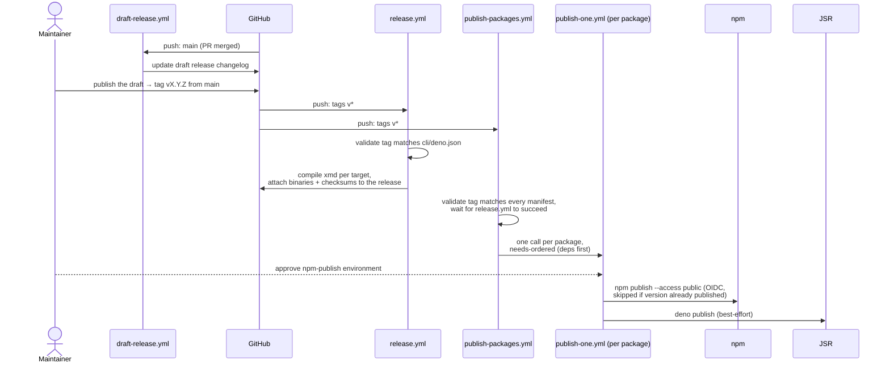

# Specification: Release process

* **Status:** Current
* **Scope:** How a version of executable.md ships: tagging, binary release, and
  npm/JSR package publishing.

---

## 1. Overview

Every merge to `main` updates a rolling draft release whose notes list the
PRs merged since the last published release. A release is triggered by a
maintainer publishing that draft via the GitHub Releases UI, which creates a
`vX.Y.Z` tag from `main`. No workflow creates tags.

The tag starts two workflows: `release.yml` compiles the `xmd` binaries and
attaches them to the release, and `publish-packages.yml` publishes every
`@executablemd/*` package to npm (primary) and JSR (secondary). Binaries come
first: `publish-packages.yml` publishes nothing until `release.yml` succeeds,
so npm versions never exist without matching binaries. Both workflows build
from the tag's commit.



## 2. Version lockstep

Every package (`core`, `cli`, `durable-streams`, `runtime`,
`packages/code-review-agent`) declares the same version in its `deno.json` and
`package.json`. `cli/src/cli.ts` imports `cli/deno.json` and reads `version`
from it, so the compiled binary reports the manifest version — the manifests
are the single source. The npm version derives from the tag, and both
workflows refuse a tag the manifests do not declare, so the two cannot
diverge.

To cut a release: bump the version in every manifest, merge to `main`, then
create the `vX.Y.Z` tag.

## 3. Workflows

- **`draft-release.yml`** (`push: main`): maintains the rolling draft release
  with release-drafter (config: `.github/release-drafter.yml`). Each merged PR
  appends a changelog line; publishing the draft cuts the release. Before
  publishing, set the tag to the version the manifests declare — the guards
  below refuse a mismatched tag.
- **`release.yml`** (`push: tags v*`): validates the tag against
  `cli/deno.json`, compiles `xmd` per target with
  `--include packages/code-review-agent`, and attaches the binaries and sha256
  checksums to the tag's GitHub Release.
- **`publish-packages.yml`** (`push: tags v*`): GENERATED by
  `scripts/gen-publish-workflow.md` — an executable markdown document that
  derives the jobs from the workspace manifests — never edited by hand. Run
  `deno task gen:publish-workflow` after adding/removing a
  workspace package or changing its `@executablemd` dependencies; CI fails if
  the committed file is stale. Its `version` job validates the tag against
  every manifest and polls the `release.yml` run for the same commit, failing
  if the binary build fails. It then fans out one `publish-one.yml` call per
  package, ordered with `needs:` so dependencies publish before dependents
  (leaves run in parallel).
- **`publish-one.yml`** (`workflow_call`, inputs `package`/`version`): builds
  one package with dnt (`scripts/build-npm.ts`) and publishes it. Runs in the
  `npm-publish` environment. npm publishing is idempotent: it skips an
  already-published version. JSR publishing is best-effort and does not fail
  the run.

## 4. npm authentication (OIDC, no token)

`publish-one.yml` authenticates to npm with GitHub Actions OIDC trusted
publishing; the repo holds no npm token. Each package's trusted publisher on
npmjs.com (Settings → Trusted Publisher → GitHub Actions):

| Field                | Value                  |
| -------------------- | ---------------------- |
| Organization or user | `taras`                |
| Repository           | `executable.md`        |
| Workflow filename    | `publish-packages.yml` |
| Environment name     | `npm-publish`          |
| Allowed actions      | `npm publish`          |

npm validates the **calling** workflow's filename for `workflow_call`, not the
reusable `publish-one.yml`. Binding the environment name makes npm reject OIDC
tokens minted outside the gated environment.

## 5. Protection configuration

- The **`npm-publish` environment** requires reviewer approval and deploys
  only for `v*` tags, and every npm trusted publisher is bound to it (§4).
- **Rulesets** require PRs into `main` and restrict `v*` tag creation to
  maintainers.

## 6. Adding a new package

npm exposes trusted-publisher settings only on a package that already exists,
and the workflows carry no npm token, so bootstrap a new package by hand once:

1. Add its directory to `workspace` in the root `deno.json`, with a `deno.json`
   (name under `@executablemd`) and a `package.json` declaring its dependencies
   (`workspace:*` for internal siblings). Run `deno task gen:publish-workflow`
   and commit the regenerated orchestrator.
2. Publish its first version by hand as a logged-in `@executablemd` scope
   owner:
   ```sh
   deno run -A scripts/build-npm.ts <package-dir> <version>
   ( cd <package-dir>/npm && npm publish --access public )
   ```
3. Configure its trusted publisher with the table in §4.
4. Create the package on jsr.io under the `@executablemd` scope and link it to
   this repository — `deno publish` fails for a package that does not exist on
   JSR (the pipeline treats that failure as non-fatal, but the package will
   not appear on JSR until it is created).

## 7. Recovery

Re-run failed jobs on the tag's own workflow run. Publishing skips an
already-published version, so re-runs and re-tags of hand-bootstrapped
versions succeed. No dispatch path publishes outside a tag.

## 8. Consumer note

`@executablemd/core`, `@executablemd/runtime`, and `@executablemd/cli` depend
on effection's 4.x prerelease, which npm's peer resolver rejects against
`@effectionx/*` (`^3 || ^4`). Installing them requires `--legacy-peer-deps`
until effection 4 is stable.
