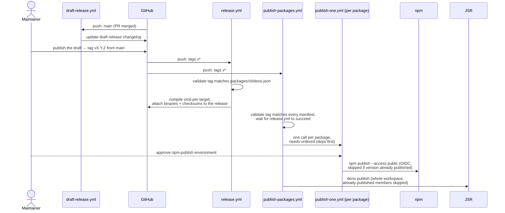

# Specification: Release process

* **Status:** Current
* **Scope:** How a version of executable.md ships: tagging, binary release, and
  npm/JSR package publishing.

---

## 1. Overview

Every merge to `main` updates a rolling draft release whose notes list the
PRs merged since the last published release. A release is triggered by a
maintainer publishing that draft via the GitHub Releases UI, which creates a
`vX.Y.Z` tag from `main`. No workflow creates tags.

The tag starts two workflows: `release.yml` compiles the `xmd` binaries and
attaches them to the release, and `publish-packages.yml` publishes every
`@executablemd/*` package to npm (primary) and JSR (secondary). npm publishes
per package; JSR publishes all workspace packages together. Binaries come
first: `publish-packages.yml` publishes nothing until `release.yml` succeeds,
so npm versions never exist without matching binaries. Both workflows build
from the tag's commit.


```mermaid
sequenceDiagram
    actor M as Maintainer
    participant DR as draft-release.yml
    participant GH as GitHub
    participant R as release.yml
    participant PP as publish-packages.yml
    participant PO as publish-one.yml (per package)
    participant NPM as npm
    participant JSR as JSR

    GH->>DR: push: main (PR merged)
    DR->>GH: update draft release changelog
    M->>GH: publish the draft → tag vX.Y.Z from main
    GH->>R: push: tags v*
    GH->>PP: push: tags v*
    R->>R: validate tag matches packages/cli/deno.json
    R->>GH: compile xmd per target,<br/>attach binaries + checksums to the release
    PP->>PP: validate tag matches every manifest,<br/>wait for release.yml to succeed
    PP->>PO: one call per package,<br/>needs-ordered (deps first)
    M-->>PO: approve npm-publish environment
    PO->>NPM: npm publish --access public (OIDC,<br/>skipped if version already published)
    PP->>JSR: deno publish (whole workspace,<br/>already-published members skipped)
```

## 2. Version lockstep

Every publishable package (`packages/core`, `packages/cli`,
`packages/durable-streams`, `packages/runtime`, `packages/testing`,
`packages/code-review-agent`, `packages/test-agent`, `packages/acp`,
`packages/web`) declares the same version in its `deno.json` and
`package.json`. A member marked `"private": true` is outside the lockstep
because it never publishes — `packages/test-support` is the one, and it stays
at `0.0.0`. `packages/cli/src/cli.ts`
imports `packages/cli/deno.json` and reads `version`
from it, so the compiled binary reports the manifest version — the manifests
are the single source. The npm version derives from the tag, and both
workflows refuse a tag the manifests do not declare, so the two cannot
diverge.

To cut a release: run `deno task bump <version>` (stamps every manifest),
restamp the workspace versions in `bun.lock`, merge to `main`, then publish the
draft release — its tag follows the manifests (§3).

`bun.lock` records a `version` for every workspace member, and the bump task
does not touch it — `bun install` will not restamp those entries either, since
they already satisfy the lockfile. Left alone they keep the previous release's
number. Only the members whose `name` is an `@executablemd` package change; an
unrelated dependency that happens to share the old version number must not.

The bump touches nothing else. PR Review and Repo Analysis install
the latest published release rather than a pinned version, so preparing a
release never depends on a binary that release has not published yet.

## 3. Workflows

- **`draft-release.yml`** (`push: main`): maintains the rolling draft release
  with release-drafter (config: `.github/release-drafter.yml`). Each merged PR
  appends a changelog line; publishing the draft cuts the release. After every
  merge the workflow syncs the draft with the manifests: when the manifest
  version is already released, the draft's notes carry a warning banner saying
  the manifests need bumping; once bumped, the banner clears and the draft's
  tag and title default to the guard-passing `v<version>`.
- **`release.yml`** (`push: tags v*`): a preflight job validates the tag
  against `packages/cli/deno.json`; on mismatch it flags the just-published release on
  the Releases page — caution note in the notes, a failed title, and the
  prerelease marker — so a forgotten bump is visible where the release was
  made, then refuses to build. On a valid tag it compiles
  `packages/cli/src/compiled.ts` per target with
  `--include packages/code-review-agent` and attaches the binaries and
  sha256 checksums to the tag's GitHub Release. That module is the
  compiled-binary entrypoint: it installs the `API.Env.command` adapter that
  relaunches the binary as itself, which a source entrypoint cannot do.
- **`publish-packages.yml`** (`push: tags v*`): GENERATED by
  `scripts/gen-publish-workflow.md` — an executable markdown document that
  expands the root `workspace` entries (including one-level globs such as
  `packages/*`) and derives the jobs from the member manifests it finds, a
  member without a `deno.json` naming an `@executablemd` package being skipped
  — never edited by hand. A member whose `package.json` declares
  `"private": true` is also skipped and appears in no npm job, so a package can
  land its foundation on `main` before it is ready to publish; clearing the flag
  adds it back on the next regeneration. Such a member also declares no
  `deno.json` `name` and no `exports`, so `deno install` warns about neither an
  unpublishable name nor a missing `exports`, and `deno publish` finds no JSR
  entry to publish either; both fields land in the same PR that clears the
  private flag. The two conditions are independent rules, and no repository
  member reaches the second one on its own, so
  `scripts/tests/publish-workflow-generator.test.ts` runs the generator over a
  fixture member that holds a full JSR identity and declares `"private": true`.
  Run
  `deno task gen:publish-workflow` after adding/removing a
  workspace package or changing its `@executablemd` dependencies; CI fails if
  the committed file is stale. Its `version` job validates the tag against
  every manifest and polls the `release.yml` run for the same commit, failing
  if the binary build fails. It then fans out one `publish-one.yml` call per
  package, ordered with `needs:` so dependencies publish before dependents
  (leaves run in parallel), plus one `jsr` job for the whole workspace.
- **`publish-one.yml`** (`workflow_call`, inputs `package`/`version`): builds
  one package with dnt (`scripts/build-npm.ts`) and publishes it to npm. Runs in
  the `npm-publish` environment. npm publishing is idempotent: it skips an
  already-published version. Library entry points come from the member's
  `deno.json` `exports`; an executable comes from its `package.json` `bin`, so
  the npm CLI ships `packages/cli/src/node.ts` while JSR gets the Deno
  entrypoint.

No published package may depend on a `jsr:` specifier. dnt rewrites one into a
`@jsr/*` npm dependency, which the default registry does not serve, so every
consumer would need a `@jsr:registry` mapping in their own npm configuration —
something a package cannot ship, because npm strips `.npmrc` from published
tarballs. Verify it on the emitted manifest: after a `scripts/build-npm.ts` run,
`packages/<name>/npm/package.json` declares no `@jsr/*` dependency.

### Local builds

A normal build installs the package's dependencies from npm and resolves its
siblings to their published versions. That is the path `publish-one.yml` runs.

`DNT_SKIP_INSTALL=1` skips that install and the type check, for exercising the
tooling before a version reaches npm. It covers only packages that declare no
`workspace:*` dependencies. dnt emits through TypeScript, which resolves from
the output directory, so the install is what supplies a sibling's declarations;
without it a sibling resolves to its workspace source and lands in the package.
The builder therefore refuses a package that declares one, naming the
dependencies and leaving the output directory empty. Release workflows never set
the variable.

`DNT_LOCAL_SIBLINGS=1` builds each internal sibling first — depth-first over the
`workspace:*` dependencies, once per package — and depends on those artifacts by
absolute path (`file:<package-dir>/npm`) instead of by published version. The
build therefore type-checks against the sources in the working tree, which is
what a branch changing a shared API needs and what the `packages/cli` npm suite
runs. The emitted package.json names local directories, so an artifact built this
way is a verification artifact, never a publishable one. Release workflows never
set the variable.

### JSR publishing

`deno publish` runs once from the repo root and publishes every workspace member
together. Members reference each other by bare name (`@executablemd/core`) with
no import-map entry: Deno resolves those through workspace membership, and
`deno publish` records them as `jsr:` dependencies. A member manifest must not
map a sibling to a relative path — a path that leaves the package root resolves
against the publish root and the module graph fails to build.

A JSR failure fails the release. The job needs no idempotency guard of its own:
the pinned Deno v2.9.1 queries the registry and skips each workspace member JSR
already carries at that version, member by member. A rerun after a partial publish
therefore completes exactly the members that are missing, and a rerun after a
complete publish exits 0 without republishing. Never gate the job on one
package's existence — whether `core` is published says nothing about the other
six.

`deno task check:jsr` runs the same command with `--dry-run` and is a required
CI job on every PR (§3, `ci.yml`). It enforces JSR's fast-check rules, so every
symbol in a package's public API needs an explicit type annotation and no export
may be a destructuring. It does not exercise the publish-time module-graph
rewrite, which only a real publish reaches.

## 4. npm authentication (OIDC, no token)

`publish-one.yml` authenticates to npm with GitHub Actions OIDC trusted
publishing; the repo holds no npm token. Each package's trusted publisher on
npmjs.com (Settings → Trusted Publisher → GitHub Actions):

| Field                | Value                  |
| -------------------- | ---------------------- |
| Organization or user | `taras`                |
| Repository           | `executable.md`        |
| Workflow filename    | `publish-packages.yml` |
| Environment name     | `npm-publish`          |
| Allowed actions      | `npm publish`          |

npm validates the **calling** workflow's filename for `workflow_call`, not the
reusable `publish-one.yml`. Binding the environment name makes npm reject OIDC
tokens minted outside the gated environment.

## 5. Protection configuration

- The **`npm-publish` environment** requires reviewer approval and deploys
  only for `v*` tags, and every npm trusted publisher is bound to it (§4). The
  `jsr` job runs in it too, so both registries admit the same publishers.
- **Rulesets** require PRs into `main` and restrict `v*` tag creation to
  maintainers.

## 6. Adding a new package

npm exposes trusted-publisher settings only on a package that already exists,
and the workflows carry no npm token, so bootstrap a new package by hand once:

1. Create its directory under `packages/` with a `deno.json` (name under
   `@executablemd`) and a `package.json` declaring its dependencies
   (`workspace:*` for internal siblings). The root `deno.json` covers it through
   the `packages/*` workspace glob, so membership needs no edit. Run
   `deno task gen:publish-workflow` and commit the regenerated orchestrator.
2. Publish its first version by hand as a logged-in `@executablemd` scope
   owner:
   ```sh
   deno run -A scripts/build-npm.ts <package-dir> <version>
   ( cd <package-dir>/npm && npm publish --access public )
   ```
   This covers a package with no `workspace:*` dependencies. A package that
   declares them cannot build its first artifact until those sibling versions
   are on npm, because the build resolves siblings from the registry. That
   bootstrap is tracked in #152 rather than specified here.
3. Configure its trusted publisher with the table in §4.
4. Create the package on jsr.io under the `@executablemd` scope and link it to
   this repository, **before** the first tagged release that includes it.
   `deno publish` fails for a package that does not exist on JSR, and the JSR
   job publishes the workspace as a unit — so one uncreated package fails the
   release for every package.

## 7. Recovery

Re-run failed jobs on the tag's own workflow run. Publishing skips an
already-published version, so re-runs and re-tags of hand-bootstrapped
versions succeed. This holds per package on both registries: npm's guard runs
per `publish-one.yml` call, and `deno publish` filters already-published
workspace members individually — so a rerun after a partial publish picks up
only what is missing. No dispatch path publishes outside a tag.

## 8. Browser assets (`@executablemd/web`)

`packages/web`'s browser client (`packages/web/client/**`) bundles through
`scripts/build-web-client.ts` (`deno task build:web`) into
`packages/web/generated/client-bundle.ts` — gitignored, never committed. The
Deno test suite (`scripts/tests/build-web-client.test.ts`) bundles and
inspects the real output, asserting determinism, absence of eval and
external-asset paths under the fixed CSP policy, that a build leaves the
installed dependency tree and its manifests exactly as it found them, and that
the build script writes its module wherever `--out` names. The suite writes to
scratch paths of its own rather than to the generated path: that path is read by
every other check in the verification battery while the suite runs (AGENTS.md),
and a test that took a turn at writing it would be a race rather than a check.

A build installs nothing: `deno task build:web` runs under node-modules and
cache modes that cannot create, relink, or fetch, and refuses on an unprepared
worktree (`scripts/preflight.ts`). Preparation is `deno task deps`, which owns
`node_modules/`, the cached module graphs, and the `sideEffects` fact. So every
job that builds, packages, publishes, or releases the workspace runs
`deno task deps` and then `deno task build:web`:

- **`ci.yml`'s `test-deno` job**, because the suite builds the CLI's npm artifact
  and dnt packages `@executablemd/web` along with it.
- **`ci.yml`'s `test-node` job**, before `pnpm install` rather than after:
  the Node typecheck resolves the module's literal dynamic import, and
  `deno task deps` rewrites `node_modules` into Deno's layout, so pnpm's install
  has to come last. The build between them changes nothing there.
- **`ci.yml`'s `jsr` job**, so the dry run validates the artifact the release
  uploads rather than a bundle-less variant of it.
- **`ci.yml`'s `smoke` job**, through the root `build` task, which chains the
  bundle build ahead of `deno compile`.
- **`publish-one.yml`**, unconditionally rather than only for `packages/web` —
  dnt builds a package's workspace siblings too.
- **`publish-packages.yml`'s `jsr` job**, generated from
  `scripts/gen-publish-workflow.md`.
- **`release.yml`**, before the matrix compile step. It invokes `deno compile`
  directly rather than through the root task, so it needs its own step.

Neither publishing nor compiling reports the omission. `deno publish` finds the
negated glob matching nothing and says so quietly; `deno compile` succeeds and
produces a binary that runs, serves a page, and cannot load its client. The
ordering is therefore asserted by test — `scripts/tests/publish-workflow-generator.test.ts`
for the JSR job and `scripts/tests/publish-workflow-membership.test.ts` for the
release workflow — and `ci.yml`'s smoke job serves a real form from the compiled
binary and reads the client asset back over HTTP, which is the only check that
can tell an embedded bundle from a missing one.

A job that skipped the build fails with a module-not-found naming a path nobody
chose, which is why `packages/web/src/assets.ts` reports the missing bundle by
naming the command instead.

The module is gitignored, so `deno publish` excludes it by default and then
refuses the package: it sits in the module graph and would not exist at runtime.
`packages/web/deno.json` un-excludes it with a negated `publish.exclude` glob, so
the published package carries the bundle it needs while the repository still does
not track it.

Tree-shaking the dead runtime-validator path out of the bundle needs
`@rjsf/validator-ajv8` declared side-effect-free, which the package ships
without. `deno task deps` records that fact, and a build asserts it and fails
pointing at `deno task setup` when it is absent.

It is recorded on *every* installed copy, because the tree is a union of two
stores and which copy the bundler reads depends on how it resolves: Deno's
automatic mode reaches the root store, while `--node-modules-dir=manual`
resolves the way Node does and reaches pnpm's copy under
`packages/web/node_modules` — the difference between a 606 KB tree-shaken
bundle and a 734 KB one carrying `new Function`. `pnpm install` restores its own
copy from its store, so `deno task setup` records the fact after it rather than
before.

`scripts/lib/staged-write.ts` writes through a staged file named for the
invocation and renames it into place, so a concurrent preparation cannot delete
another's staging, a cancelled one waits for its own in-flight write before
removing it, and a reader sees either every old byte or every new one.

Bundling is Deno-only; the shape of the generated module is not. Its serializer
(`scripts/lib/web-client-module.ts`) touches no host, so
`scripts/tests/web-client-module.test.ts` loads generated modules and checks
their round-trip and byte-length contract under Deno, Node, and Bun.

A publishable `@executablemd/web` is an atomic configuration state: public
`deno.json` identity and `exports`, `private` cleared from `package.json`,
`build:web` run immediately before both JSR and npm packaging, and explicit
inclusion of `generated/client-bundle.ts` in both published artifacts. The
configuration elements change atomically; the package is never published
without its browser asset and never published while private.

`packages/web` is currently private. It carries no release hook, no `deno.json`
`name` or `exports`, and no npm or JSR publish job (§3).

## 9. Consumer note

`@executablemd/core`, `@executablemd/runtime`, `@executablemd/testing`,
`@executablemd/cli`, and `@executablemd/test-agent` depend on effection's 4.x
prerelease, which npm's peer
resolver rejects against `@effectionx/*` (`^3 || ^4`). Installing them
requires `--legacy-peer-deps` until effection 4 is stable.
